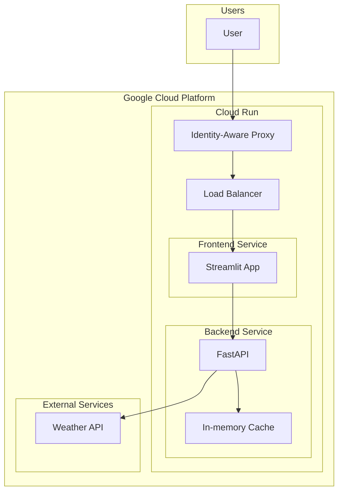

# Weather Data Analysis Application Plan

## Project Overview

We'll build a weather data analysis application with:
- **Frontend**: Streamlit dashboard showing weather forecasts and visualizations
- **Backend**: FastAPI service providing weather data through endpoints
- **Deployment**: Docker containers deployed to Google Cloud Run in us-central1

## Architecture Design



## Project Structure

```
sample_streamlit_app/
├── frontend/
│   ├── app.py               # Streamlit application
│   ├── Dockerfile           # Frontend container configuration
│   └── requirements.txt     # Frontend dependencies
├── backend/
│   ├── main.py              # FastAPI application
│   ├── weather.py           # Weather data handling
│   ├── Dockerfile           # Backend container configuration
│   └── requirements.txt     # Backend dependencies
├── docker-compose.yml       # Local development setup
├── .env.example             # Template for environment variables
├── README.md                # Project documentation
└── cloud-deployment/        # GCP deployment files
    ├── frontend-service.yaml
    ├── backend-service.yaml
    └── load-balancer.yaml
```

## Implementation Plan

### 1. Backend Development

#### FastAPI Application
- Create a FastAPI application with the following endpoints:
  - `/api/health`: Health check endpoint
  - `/api/weather/current`: Get current weather for a location
  - `/api/weather/forecast`: Get weather forecast for a location

#### Weather Data Service
- Implement a basic caching mechanism to avoid hitting rate limits
- Use a free weather API service (OpenWeatherMap or similar)
- Store API key in environment variables

#### Error Handling
- Implement proper error handling for API requests
- Return meaningful error messages and status codes

#### Configuration
- Set up environment-based configuration
- Configure CORS to allow requests from Streamlit frontend

### 2. Frontend Development

#### Streamlit Dashboard
- Create a Streamlit dashboard with:
  - Location selection (city name input)
  - Current weather display with key metrics (temperature, humidity, wind, etc.)
  - Forecast visualization with charts for daily/hourly predictions
  - Weather condition icons and visual indicators
  - Basic styling and user-friendly interface

#### API Integration
- Connect to backend API endpoints with proper error handling
- Implement caching to reduce load on backend
- Add loading states for better user experience

#### Visualization
- Create visualizations for temperature trends
- Display humidity, precipitation, and wind data
- Show daily and hourly forecasts

### 3. Containerization

#### Docker Configuration
- Create Dockerfiles for both frontend and backend
- Configure multi-stage builds for optimized container images
- Set up shared networking and configuration

#### Local Development
- Set up docker-compose for local development and testing
- Configure environment variables for local dev

#### Testing
- Implement health checks in both containers
- Test container communication locally before deployment

### 4. Google Cloud Deployment

#### Cloud Run Setup
- Configure Cloud Run services for frontend and backend
- Set up environment variables for production
- Configure memory and CPU allocation

#### Security
- Set up IAP (Identity-Aware Proxy) for authentication
- Configure service accounts with minimal permissions
- Secure API keys and sensitive configuration

#### Load Balancing
- Configure load balancer for traffic distribution
- Set up health checks for services
- Configure auto-scaling based on traffic patterns

#### Networking
- Set up VPC and firewall rules if needed
- Configure custom domains if required
- Set up SSL certificates for secure communication

### 5. Testing and Documentation

#### Documentation
- Create comprehensive README with setup instructions
- Document API endpoints with examples
- Include troubleshooting guidelines
- Add deployment instructions for Google Cloud

#### Testing
- Create basic tests for API endpoints
- Test frontend-backend integration
- Verify deployment on cloud infrastructure

## Dependencies

### Backend
- FastAPI
- Uvicorn (ASGI server)
- Requests (for external API calls)
- Python-dotenv (for environment variables)
- Pydantic (for data validation)

### Frontend
- Streamlit
- Pandas (for data manipulation)
- Matplotlib/Plotly (for data visualization)
- Requests (for API calls)
- Pillow (for image processing)

## Local Development Setup
1. Clone the repository
2. Create `.env` file from `.env.example` template
3. Run `docker-compose up` to start both services
4. Access frontend at `http://localhost:8501`
5. Access backend at `http://localhost:8000`

## Google Cloud Deployment Steps
1. Build and push container images to Google Container Registry
2. Deploy backend service to Cloud Run
3. Deploy frontend service to Cloud Run
4. Configure IAP for authentication
5. Set up load balancer for traffic distribution
6. Test deployed services

## Testing the Deployment
1. Access the frontend through the load balancer URL
2. Verify authentication through IAP
3. Test weather data retrieval functionality
4. Simulate load to test scaling capabilities