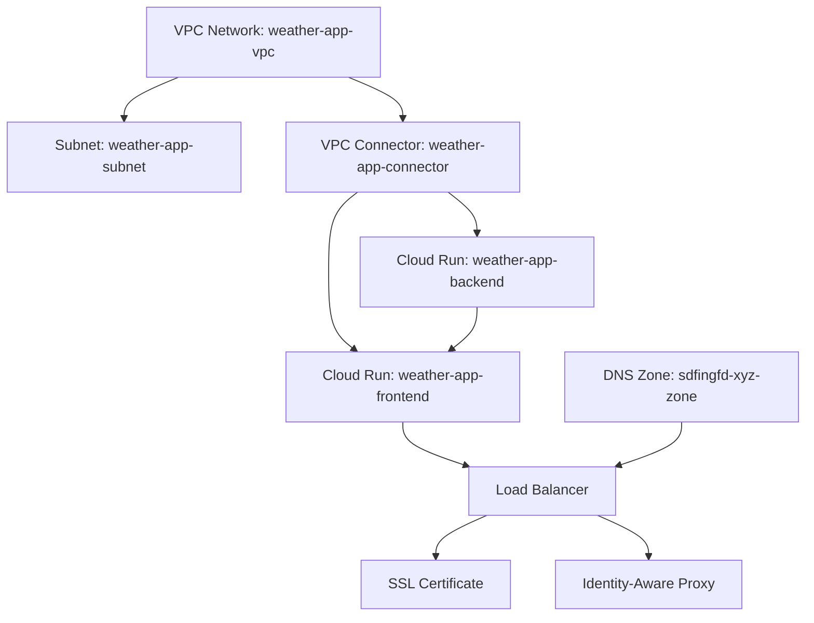

# Terraform Architecture

%%{init: {'theme': 'default', 'themeVariables': { 'fontSize': '16px', 'fontFamily': 'arial', 'nodeSpacing': 50, 'rankSpacing': 50 }}}%%

```mermaid
graph TB
    VPC[VPC Network: weather-app-vpc]
    SUBNET[Subnet: weather-app-subnet]
    CONNECTOR[VPC Connector: weather-app-connector]
    BACKEND[Cloud Run: weather-app-backend]
    FRONTEND[Cloud Run: weather-app-frontend]
    LB[Load Balancer]
    DNS[DNS Zone: sdfingfd-xyz-zone]
    CERT[SSL Certificate]
    IAP[Identity-Aware Proxy]
    
    VPC --> SUBNET
    VPC --> CONNECTOR
    CONNECTOR --> BACKEND
    CONNECTOR --> FRONTEND
    BACKEND --> FRONTEND
    FRONTEND --> LB
    LB --> CERT
    LB --> IAP
    DNS --> LB
``` 